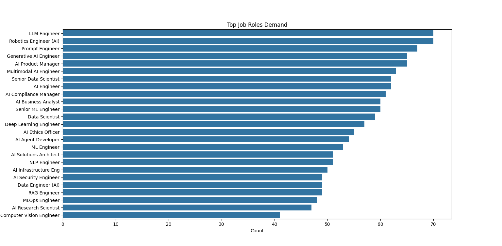
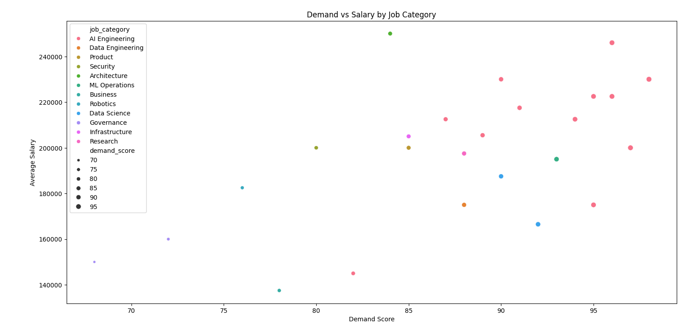
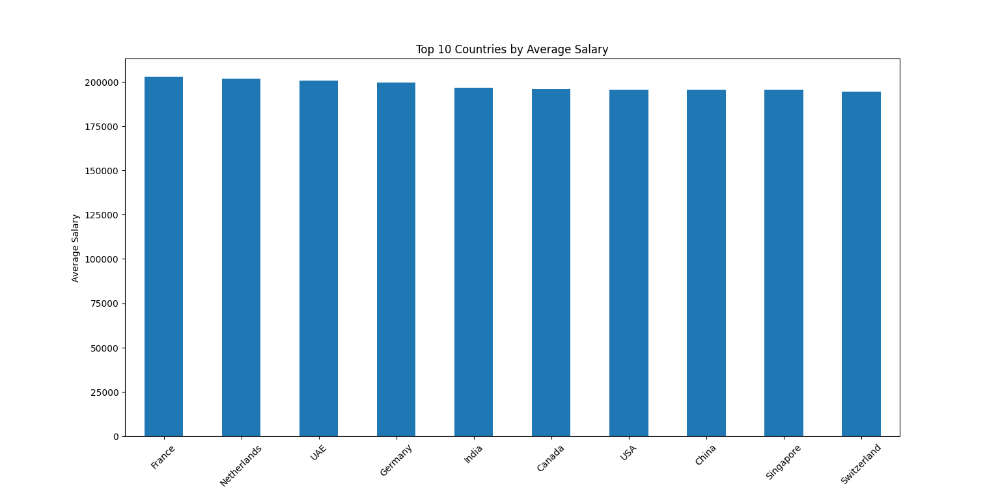
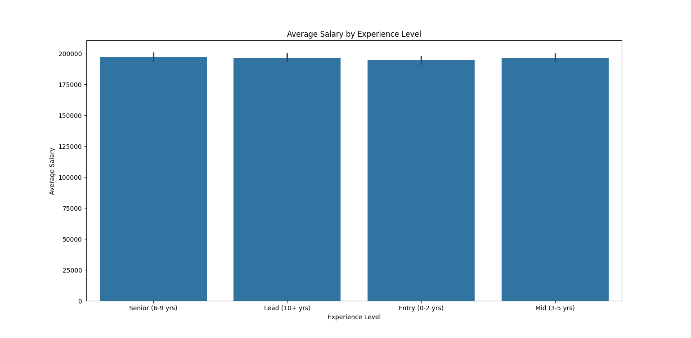

# 🚀 IT Job Market Analysis (2025–2026)

## 📌 Project Overview
This project performs an end-to-end analysis of the AI & IT job market using real-world data. The goal is to understand how factors such as job demand, experience level, and location influence salary trends across various technology roles.

The analysis focuses on extracting meaningful insights from job postings and presenting them through structured analysis and visualizations.

---

## 🛠 Tech Stack
- **Python**
- **Pandas** – Data manipulation & analysis  
- **Seaborn** – Statistical data visualization  
- **Matplotlib** – Data visualization and plotting  

---

## 📂 Dataset
- **AI Jobs Market Dataset (2025–2026)**
- Contains:
  - Job roles
  - Salary information
  - Demand scores
  - Experience levels
  - Country-wise data
  - AI/ML market trends

---

## ⚙️ Data Processing
The dataset was cleaned and prepared before analysis:

- Standardized column names
- Removed non-geographical entries such as `"Global"`
- Created a new feature: **Average Salary**
- Processed data for visualization and insight generation

---

## 📊 Exploratory Data Analysis (EDA)

### 1️⃣ Job Role Demand Analysis
Analyzed the most in-demand roles in the AI & IT industry.

#### Top Roles:
- LLM Engineer  
- Robotics Engineer  
- Prompt Engineer  
- Generative AI Engineer  

👉 **Insight:** Emerging AI-focused roles dominate market demand.

---

### 2️⃣ Experience vs Salary
Compared salary distribution across experience levels:

- Entry (0–2 yrs)
- Mid (3–5 yrs)
- Senior (6–9 yrs)
- Lead (10+ yrs)

👉 **Insight:** Salary variation across experience levels is smaller than expected, indicating skill specialization plays a major role.

---

### 3️⃣ Country-wise Salary Analysis
Analyzed salary trends across different countries.

#### Highest Paying Regions:
- France
- Netherlands
- UAE
- Germany

👉 **Insight:** European regions show slightly higher average compensation for AI-related roles.

---

### 4️⃣ Demand vs Salary Analysis 🔥
Visualized the relationship between:
- Job demand
- Salary
- Job category

👉 **Key Findings:**
- Strong positive relationship between demand and salary
- High-demand roles tend to offer higher compensation
- AI/ML-related roles dominate premium salary ranges

---

## 📈 Key Insights

- 📌 High-demand roles generally offer higher salaries
- 📌 AI & ML roles dominate both demand and compensation
- 📌 Skill specialization is highly valued in the market
- 📌 Location impacts salary, but demand plays a stronger role
- 📌 Emerging AI roles are reshaping the technology job market

---

## 📸 Sample Visualizations

### 🔹 Top Job Roles Demand

---

### 🔹 Demand vs Salary by Job Category

---

### 🔹 Country-wise Salary Analysis

---

### 🔹 Experience vs Salary

---

## 🚀 Conclusion

This project demonstrates practical skills in:
- Data cleaning
- Exploratory Data Analysis (EDA)
- Data visualization
- Insight generation
- Working with real-world datasets

The analysis highlights that job demand plays a key role in determining salary trends, particularly in AI and Machine Learning domains where high-demand roles consistently cluster within higher salary ranges.

---

## 💼 Author
**K R Amal Mohammed**
